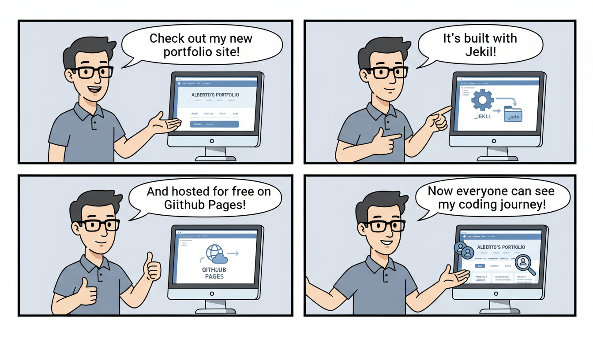

This is a comprehensive and professional `README.md` tailored for your portfolio repository.

---

# [Alberto Lasheras] Portfolio 🚀

Welcome to the source code of my personal portfolio website. This project serves as a centralized hub to showcase my professional journey, technical projects, and contact information.

**Live Demo:** [https://lasheralberto.github.io/](https://lasheralberto.github.io/)

## 🛠 Tech Stack

This site is built as a static website powered by **Jekyll** and hosted via **GitHub Pages**.

*   **Static Site Generator:** [Jekyll](https://jekyllrb.com/)
*   **Templating Engine:** Liquid
*   **Styling:** Custom CSS3 (Modern, responsive layouts)
*   **Interactivity:** Vanilla JavaScript
*   **Hosting:** GitHub Pages

---

## 📂 Project Structure

The repository follows a standard Jekyll structure optimized for GitHub Pages:

```text
├── _config.yml          # Site configuration and metadata
├── _includes/           # Reusable HTML components
│   └── header.html      # Site navigation and branding
├── _layouts/            # Page templates
│   ├── default.html     # Base layout for all pages
│   └── home.html        # Specific layout for the landing page
├── assets/              # Static assets
│   ├── css/             # Stylesheets (home_css.css, style.css)
│   └── js/              # Client-side scripts (tabmein.js)
├── index.md             # The landing page content
├── projects.md          # Portfolio showcase page
├── contact.md           # Contact information/form page
└── README.md            # Project documentation
```

---

## 🚀 Getting Started

To run this project locally for development or testing, follow these steps:

### Prerequisites
*   Ruby and RubyGems installed.
*   Jekyll and Bundler: `gem install jekyll bundler`

### Local Setup
1.  **Clone the repository:**
    ```bash
    git clone https://github.com/lasheralberto/lasheralberto.github.io.git
    cd lasheralberto.github.io
    ```

2.  **Install dependencies:**
    ```bash
    bundle install
    ```

3.  **Serve the site:**
    ```bash
    bundle exec jekyll serve
    ```

4.  **View the site:**
    Open your browser and navigate to `http://localhost:4000`.

---

## 🔧 Customization

### 1. Global Settings
Edit `_config.yml` to update your site title, description, and social media links:
```yaml
title: Alberto Lasheras
email: your-email@example.com
description: Portfolio showcasing my software engineering projects.
baseurl: "" 
url: "https://lasheralberto.github.io"
```

### 2. Adding Projects
The `projects.md` file handles the display of your work. You can add new project entries directly into the markdown file using the predefined layouts.

### 3. Styling
Global styles are located in `assets/css/style.css`, while home-page specific styles reside in `assets/css/home_css.css`. The site uses a responsive design approach to ensure compatibility across mobile, tablet, and desktop devices.

### 4. Interactive Tabs
The `assets/js/tabmein.js` script manages interactive elements (such as tabbed project views or navigation transitions), ensuring a smooth user experience.

---

## 📸 Features

-   **Responsive Design:** Fully optimized for all screen sizes.
-   **SEO Friendly:** Optimized metadata via Jekyll configuration.
-   **Fast Loading:** Minimalist footprint with no heavy frameworks.
-   **Clean Navigation:** Persistent header managed via Jekyll Includes.

---

## 📜 License

This project is open-source. Feel free to fork this repository and customize it for your own portfolio. 

---

## ✉️ Contact

**Alberto Lasheras**
- Website: [lasheralberto.github.io](https://lasheralberto.github.io/)
- GitHub: [@lasheralberto](https://github.com/lasheralberto)